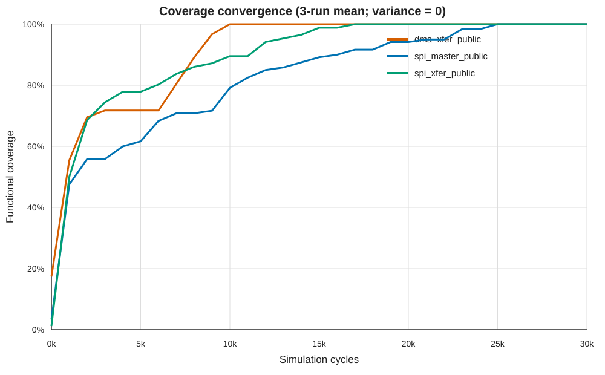

# 覆盖率报告

## 实验设置

- 环境：组委会基础镜像 `eda-coverage-base:1.0`
- 后端：Verilator 真实 RTL（`backend=verilator`）
- 预算：每 DUT 30,000 cycles，1,000 cycles 采样一次
- 重复：3 次独立进程运行，种子 260923/260924/260925
- AUC：按赛题公式对覆盖率小数与 cycle 做梯形积分

策略本身为确定性规划器，种子仅用于保留的降级探索路径；三个公开 DUT 均未进入随机降级，因此三次曲线一致、方差为 0。这是可复现性结果，不是遗漏重复实验。

## 结果

| DUT | bins | 终值（均值 ± 标准差） | AUC（均值 ± 标准差） | predict 均值 | predict P99 最大值 |
|---|---:|---:|---:|---:|---:|
| dma_xfer_public | 92/92 | 100.000% ± 0.000% | 27,368.57 ± 0.00 | 0.0460ms | 0.3547ms |
| spi_master_public | 120/120 | 100.000% ± 0.000% | 24,715.67 ± 0.00 | 0.0188ms | 0.3254ms |
| spi_xfer_public | 86/86 | 100.000% ± 0.000% | 26,993.19 ± 0.00 | 0.0184ms | 0.3068ms |

三项算术平均终值为 100.000%。所有 P99 均远低于题目建议的 30ms 单步预算。

完整采样点见 `coverage_curves.csv`，每次原始运行记录同时保存在
`experiments/verilator_full_run1.json` 至 `run3.json`。

## DMA 公开参数说明

DMA Python 快速模型和 Verilator RTL 对公开占位隐藏参数的编码行为存在差异，因此正式报告仅采用 Verilator 结果。算法按照 RTL 实际保存的 4 位字段完整探测 0~15，并通过 `coverage_meta.json` 动态定位 `xfer_done_ok`，不依赖固定覆盖向量下标。
